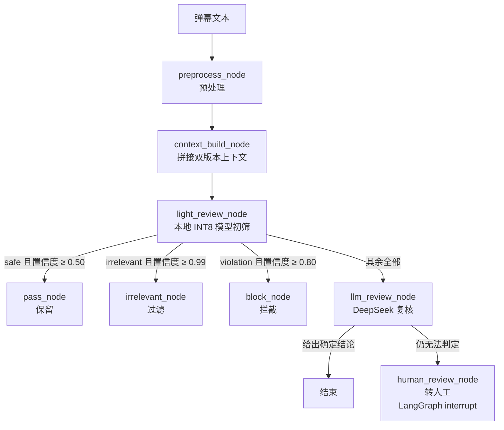
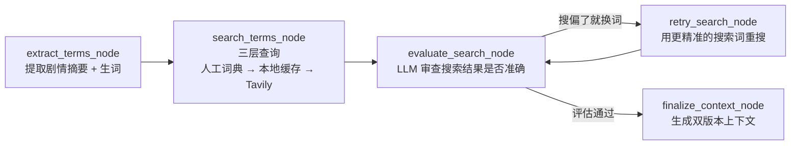

# 弹幕质量过滤系统（Danmaku Optimizer）

> 用「本地小模型 + 云端大模型」两层结构过滤弹幕：**保留剧情相关的讨论，过滤与剧情无关的噪音，拦截违规内容**。

[](https://www.python.org/)
[](https://github.com/langchain-ai/langgraph)
[](https://github.com/yzfly/edgejev)
[](https://www.deepseek.com/)

---

## 一、这个项目解决什么问题

弹幕区最大的污染源**不是违规内容，而是与剧情无关的噪音**：

| 弹幕原文 | 类型 | 是否该保留 |
|---|---|---|
| 淮安前来报到 / 陕西第一 | 地域报到 | ❌ 与剧情无关 |
| 第一 / 打卡 / 来了 | 抢楼打卡 | ❌ 与剧情无关 |
| 接好运妈妈病快点好 | 与剧情无关的许愿 | ❌ 与剧情无关 |
| 原来是紫天都改成紫天凤了 | 动画改动讨论 | ✅ 剧情相关 |
| 动捕换个人吧，动作每次都这几下子 | 制作评价 | ✅ 剧情相关 |
| 放开她让我来 | 性化骚扰 | 🚫 违规 |

传统关键词过滤两头不讨好：**既拦不住"淮安前来报到"这类噪音**（不含任何敏感词），**又会误杀剧情相关的玩梗与黑话**（如"解说大帝""让古族再次伟大"字面看着可疑）。

所以本项目把问题重新定义为**三分类**：

| 标签 | 含义 | 处置 |
|---|---|---|
| `safe` | 与本集剧情 / 角色 / 动画本体相关，有信息量 | 保留 |
| `irrelevant` | 与剧情无关的噪音 | **过滤** |
| `violation` | 违规（性化骚扰、辱骂、色情、政治敏感、广告） | 拦截 |
| `gray` | 端云均无法可靠判定 | 转人工 |

**先在 8065 条真实弹幕上标注确认这个立论**：均匀抽样 300 条逐条人工标注后，**27.3% 的弹幕应当被过滤**，其中「无关噪音」是「违规内容」的 **2.7 倍**（60 条 vs 22 条）。只做违规审核会漏掉绝大部分污染。

---

## 二、双层过滤架构



共 **8 个节点**，三类分流出口（保留 / 过滤 / 拦截）+ 人工兜底。

### 双版本上下文为什么必须分开

| 版本 | 面向 | 长度 | 内容 |
|---|---|---|---|
| `full_context` | DeepSeek | 约 1188 字 | 剧情梗概 + 逐条黑话释义 + 观众情绪倾向 |
| `short_context` | 本地 edgejev | 110 字 | 剧情一句话 + 最核心的 2-3 个梗 |

本地模型 `max_len` 只有 1024，上下文过长反而会稀释注意力、拉低判断准确率；大模型则有足够容量消化完整背景。**同一份语境，按模型能力裁剪成两种粒度**，是这套方案的核心细节。

### 预热阶段：带自我纠错的 ReAct 循环



搜索「解说大帝」很可能返回「《遮天》中的大帝级角色」——**看着像对的，其实是错的**。评估节点专门挑这种偏差，要求给出更精准的搜索词并重搜；评估通过的词**自动写入人工词典**，下次直接命中不必联网。

---

## 三、实测表现

全部为本机实测（2026-09-29），脚本与逐条结果在 `.agent-workspace/`，可复现。

### 3.1 过滤效果（300 条人工标注评测集）

| 指标 | 改进前（旧三分类） | 改进后（新四分类） |
|---|---|---|
| **应当过滤的二分类 F1** | 18.0% | **73.4%** |
| 二分类召回率 | 11.1% | **81.2%** |
| 二分类精确率 | 47.1% | **67.0%** |
| 二分类准确率 | 71.0% | **79.8%** |
| `irrelevant` 类 F1 | 0.0% | 57.1% |
| macro-F1（4 类） | 32.6% | **51.8%** |

改进前 `safe` 召回高达 92.9%，是因为它把几乎所有弹幕都判成 `safe`——**等价于近九成该过滤的弹幕会被放行**（召回率仅 11.1%）。

### 3.2 效率

| 指标 | 数值 |
|---|---|
| 本地模型加载（模型 + 构图） | 9.3 秒 |
| 本地模型纯推理 | 平均 **1064 ms/条**（中位 1046，范围 986–1183） |
| 端到端（300 条评测集） | 平均 **1886 ms/条** |

### 3.3 ⚠️ 重要发现：本地小模型不具备「相关性」判断能力

用标注集直接探测本地模型原始输出，混淆矩阵如下（行 = 真值，列 = 本地预测）：

| 真值 \ 预测 | safe | **irrelevant** | violation | gray | 合计 |
|---|---|---|---|---|---|
| **safe** | 4 | **164** | 5 | 11 | 184 |
| **irrelevant** | 1 | **57** | 1 | 1 | 60 |
| **violation** | 0 | **22** | 0 | 0 | 22 |
| **gray** | 1 | **29** | 1 | 3 | 34 |

**它把 300 条中的 272 条判成 `irrelevant`**——不是在做相关性判断，而是退化成了「绝大多数输入都输出无关」。

在真实全量弹幕（6509 条去重后均匀抽样 500 条）上，路由分布同样印证：

| 路由 | 条数 | 占比 |
|---|---|---|
| 升级 DeepSeek 复核 | 492 | **98.4%** |
| 本地放行（safe） | 4 | 0.8% |
| 本地过滤（irrelevant） | 3 | 0.6% |
| 本地拦截（violation） | 1 | 0.2% |

本地模型把 466/500 判为 `irrelevant`，但因置信度未达 0.99 门槛而全部升级云端。**结论：当前配置下本地模型几乎不承担过滤工作（仅 1.6% 流量本地处理），双层架构的成本优势在本任务上并未成立。**

> 这不是实现缺陷，而是**能力边界**：判断"是否与剧情相关"需要世界知识与语境推理，
> 而这个 421M 参数的多语言决策模型无法胜任。置信度门槛扫描显示，门槛从 0.0 提到 0.95
> 期间精确率始终停留在 32–42%，即该模型对该维度**没有区分度**。

---

## 四、技术栈

| 组件 | 用途 |
|---|---|
| **LangGraph** `StateGraph` | 编排过滤与预热两个工作流；`interrupt` 中断转人工、`MemorySaver` 保存会话状态 |
| **edgejev** | 本地轻量决策模型运行时（INT8 ONNX），以 `choice` 类型做四分类决策 |
| **DeepSeek**（`deepseek-flash`） | 云端复核与预热推理，通过 `json_mode` 做结构化输出 |
| **Pydantic** | 定义 `ModerationResult` / `TermExtraction` / `SearchEvaluation` / `ContextOutput` 四套结构化输出模型 |
| **Tavily API** | 网络热梗/黑话的实时搜索 |
| **python-dotenv** | 从 `.env` 加载 API Key |

---

## 五、目录结构

```
danmaku-optimizer/
├── danmaku_filter.py          # 过滤主逻辑：LangGraph 图、双层路由、人工复核中断
├── global_context_builder.py  # 全局上下文预热：提词 → 搜索 → 评估 → 重搜 → 生成
├── test.py                    # 入口：读上下文 → 逐条过滤 → 导出 CSV 报告
├── test2.py                   # 入口：预热阶段，生成 global_context_result.json
├── config.json                # 视频标题 / 简介 / 输出文件名
├── test.xml                   # 弹幕输入样本（B 站 XML 格式，8065 条）
├── requirements.txt           # 依赖清单
├── .env.example               # 环境变量模板（不含真实密钥）
├── data/                      # 数据与评测资产
│   ├── eval_set.jsonl               # 300 条人工标注评测集（四分类）
│   ├── labeling_criteria.py         # 标注口径与逐条判定依据
│   ├── global_context_result.json   # 预热产物：双版本上下文
│   ├── known_terms.json             # 人工词典（命中即跳过搜索与评估）
│   └── search_cache.json            # 搜索缓存
├── output/                    # 运行产物（不提交）：1graph.png、过滤结果 CSV
└── jev-int8/                  # 本地 INT8 模型（不提交，约 358 MB）
```

**所有文件路径都基于脚本所在目录（`BASE_DIR`）定位**，不再依赖当前工作目录——可以在任意路径下执行，不会出现 `FileNotFoundError`。

---

## 六、快速开始

### 1. 环境要求

- Python 3.12
- 可用的 DeepSeek API Key 与 Tavily API Key

### 2. 安装依赖

```bash
pip install -r requirements.txt
```

### 3. 配置密钥

```bash
cp .env.example .env        # Windows: copy .env.example .env
```

`.env` 内容：

```ini
DEEPSEEK_API_KEY=你的_deepseek_key
TAVILY_API_KEY=你的_tavily_key
```

> `.env` 已被 `.gitignore` 排除，请勿提交。模板见 `.env.example`。

### 4. 准备本地模型

项目需要一个 `edgejev build` 生成的模型目录，默认在项目根目录 `jev-int8/`：

```
jev-int8/
├── model.onnx        # INT8 量化模型（约 324 MB）
├── tokenizer.json    # 分词器（约 34 MB）
└── edgejev.json      # 模型配置
```

该目录体积较大、不进 Git。若模型在别处，修改 `danmaku_filter.py` 中的 `DEFAULT_MODEL_PATH`：

```python
DEFAULT_MODEL_PATH = os.path.join(BASE_DIR, "jev-int8")   # 改成你的实际路径
```

### 5. 预热全局上下文（首次必须）

```bash
python test2.py
```

调用 DeepSeek 与 Tavily 提取黑话、搜索释义、生成双版本上下文，产出 `data/global_context_result.json`。**`test.py` 启动第一件事就是读这个文件，缺少它会直接报错。**

### 6. 开始过滤

```bash
python test.py
```

输出示例：

```
📂 加载全局上下文...
   视频: 遮天 第181集
   详细版: 1188 字 | 精简版: 110 字
📂 解析弹幕 XML...
   原始 8065 条 → 取前 200 条 → 去重后 136 条
🚀 初始化 DanmakuFilter...
🔍 [诊断] Checkpointer 类型: InMemorySaver
[001] 🗑️ irrelevant | Lite过滤   |   981ms | 淮安前来报到
[002] ✅ safe      | LLM复核    |  1072ms | 原来是紫天都改成紫天凤了
[003] 🚫 violation | LLM复核    |  1747ms | 放开她让我来
...
```

### 7. 运行评测（可选）

```bash
# 端到端评测，输出逐类 F1 与二分类指标
python .agent-workspace/debug/run_eval.py data/eval_set.jsonl .agent-workspace/debug/eval_out.jsonl

# 单独探测本地模型能力 + 置信度阈值扫描（不调用云端）
python .agent-workspace/debug/probe_light_model.py data/eval_set.jsonl .agent-workspace/debug/probe.jsonl
```

---

## 七、输出说明

过滤结果保存为 `output/danmaku_review_results.csv`（UTF-8-SIG 编码，Excel 打开不乱码）：

| 列名 | 含义 | 取值 |
|---|---|---|
| `序号` | 弹幕序号 | 1, 2, 3… |
| `弹幕` | 弹幕原文 | — |
| `预测标签` | 过滤结论 | `safe` / `irrelevant` / `violation` / `gray` / `error` |
| `路由` | 走了哪条路径 | `Lite直过` / `Lite过滤` / `Lite拦截` / `LLM复核` / `人工` |
| `耗时ms` | 本地模型 + 大模型总耗时 | 毫秒 |

同时在 `output/` 下生成 `1graph.png`（流程图渲染结果）。

---

## 八、已知局限

1. **本地模型不承担过滤工作**：97–98% 流量升级云端，见 3.3 节。改进方向见第九节。
2. **评测集规模有限**：300 条、来自单集、**单标注者**，未计算标注一致性（Kappa），
   边界案例（如"解说大帝又旷工了"归为无关）存在主观性。结论用于验证可行性，未追求统计显著性。
3. **类别不平衡**：评测集中 `safe` 占 61.3%、`violation` 仅 7.3%（22 条），
   故 `violation` 维度的 F1 波动大，**不宜单独引用**。
4. **成本未优化**：当前几乎全量走云端，需靠规则前置与批处理降本。
5. **`gray` 占 11.3%**：多为信息过少（如"在""AI"），建议产品侧直接按低质量处理而非送人工。

---

## 九、下一步优化方向

1. **规则前置（性价比最高）**：「XX前来报到」「第一」「打卡」这类模板化噪音用正则与词表即可高精度识别，
   **零训练、零延迟、零成本**，可直接把云端调用量压下来。
2. **微调本地决策模型**：edgejev 自带训练链路，可直接复用本评测集：
   ```bash
   edgejev-train data --out data/          # 转训练格式
   edgejev-train fit  --data data/ --out runs/my-jev
   edgejev build --backend laya --model runs/my-jev --out ./my-jev-int8
   ```
   训练格式为 `{state, type, instructions, criteria, label|target}`，**与推理侧共用同一渲染器**，
   不存在训练/推理不一致问题；支持软标签（教师模型概率）以获得更好校准。
3. **换更强的中文编码器**：训练侧支持任意 HF 编码器（如 `mmBERT-base`），中文语义能力优于当前多语言决策模型。
4. **扩充评测集**：违规样本补至 100+ 条，扩展到 2–3 集以验证跨集迁移。

---

## 十、常见问题

**Q：`FileNotFoundError: 'global_context_result.json'`**
预热产物缺失，先跑 `python test2.py`。项目已统一使用基于脚本目录的绝对路径，若仍报错请确认文件确实位于 `data/` 下。

**Q：模型加载失败 / 找不到 `edgejev.json`**
`jev-int8/` 目录不完整或路径不对。该目录需包含 `model.onnx`、`tokenizer.json`、`edgejev.json` 三个文件。

**Q：搜索全部返回「未配置搜索引擎 API」**
`.env` 里缺少 `TAVILY_API_KEY`，或 `.env` 不在项目根目录。

**Q：`UnicodeEncodeError: 'gbk' codec`**
Windows 控制台默认 GBK 编码，无法输出 emoji。执行前设置：
```powershell
$env:PYTHONIOENCODING='utf-8'
```

**Q：`test2.py` 从别的目录运行报找不到 `config.json`**
`test2.py` 目前仍使用相对路径，请在项目根目录下运行它。

**Q：想换成别的视频/剧集？**
修改 `config.json` 的 `video_title` 与 `video_summary`，替换 `test.xml` 为新的弹幕文件，重新跑 `python test2.py` 预热即可。`known_terms.json` 里的词条会跨视频复用。

---

## 十一、设计要点回顾

1. **先定义清楚"什么是垃圾"**：把「与剧情无关的噪音」而不是「敏感词」作为主要过滤目标——这是本项目与原版审核方案最大的区别。
2. **按模型能力裁剪上下文**：大模型吃详细版（1188 字），小模型吃精简版（110 字）。
3. **搜索要有自我纠错**：LLM 评估搜索结果质量，搜偏了就换词重搜。
4. **人工词典是资产**：评估通过的词自动沉淀，越用越快、越用越省。
5. **用数据验证架构假设**：实测发现本地模型在该任务上无区分能力，据此调整为高召回粗筛 + 云端复核，而不是沿用"小模型省钱"的想当然。
6. **拿不准就交给人**：`gray` 结果通过 LangGraph `interrupt` 转人工，不硬猜。

---

## 十二、许可证与说明

本项目为弹幕质量过滤的技术验证与学习实践项目。使用时请遵守各平台的服务条款与相关法律法规，API 密钥请通过 `.env` 自行配置并妥善保管。

如用于生产环境，建议重点补充：**规则前置与批处理降本**、**本地模型微调**、**评测集扩充与标注一致性校验**、**结果缓存与失败重试**。
