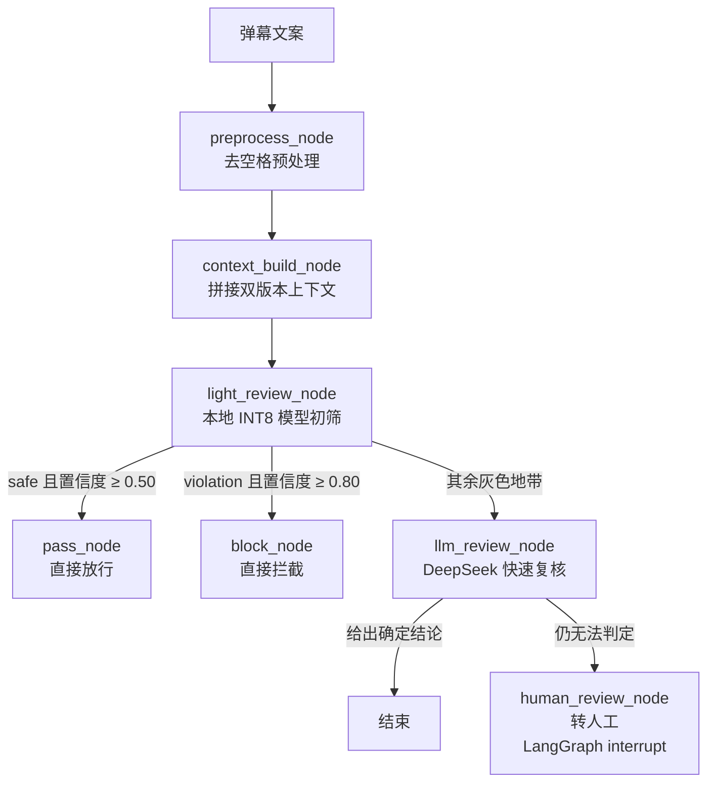
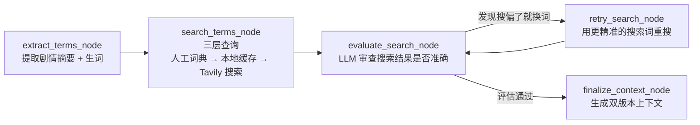

# 弹幕审核优化系统（Danmaku Optimizer）

> 用「本地小模型 + 云端大模型」两层结构，给**看不懂的弹幕黑话**搭一座桥，让内容审核判断得又快又准。

[](https://www.python.org/)
[](https://github.com/langchain-ai/langgraph)
[](https://github.com/)
[](https://www.deepseek.com/)

---

## 一、这个项目解决什么问题

动漫、网文改编剧的弹幕里充满了**圈内黑话**。这些词从字面上看毫不可疑，甚至像是攻击性语言，但实际含义完全无害：

| 弹幕原文 | 字面直觉 | 圈内真实含义 |
|---|---|---|
| 解说大帝又旷工了 | 疑似嘲讽、人身攻击 | 「解说大帝」是动画旁白员的调侃绰号，这是粉丝集体玩梗 |
| 让古族再次伟大 | 疑似政治敏感 | 借用小说中「古族」设定的夸张玩梗 |
| 小月亮我来啦 | 不明指代 | 「小月亮」是女主角姬紫月的昵称 |
| 恭迎叶天帝 | 不明指代 | 「叶天帝」是主角叶凡的最终尊号，粉丝致敬式刷屏 |

传统关键词过滤面对这类弹幕只有两种结局：**误杀**（把玩梗当中伤）或**漏放**（看不懂直接放行）。而这个项目的前提判断是：**审核系统必须先"看懂"这集视频的语境，才能判断弹幕是否违规。**

所以它把审核拆成两个阶段：

1. **离线预热**（每条视频只做一次）：自动提取弹幕中的黑话，联网搜索释义，再用大模型评估搜索质量、修正偏差，最终生成两份「全局上下文」——一份详细的给大模型，一份精简（150 字以内）的给小模型。
2. **在线审核**（每条弹幕）：带着这份上下文去判断，而不是只看孤立的文本。

---

## 二、双层审核架构



**设计取舍**：绝大部分弹幕是「淮安前来报到」「终于更新了」这类毫无风险的打卡内容，让云端大模型逐条处理既慢又贵。因此本地小模型承担高频初筛，只有它拿不准的（`gray` 或低置信度）才升级给 DeepSeek，并由上下文补足语义信息。

### 双版本上下文为什么必须分开

| 版本 | 面向 | 长度 | 内容 |
|---|---|---|---|
| `full_context` | DeepSeek 大模型 | 约 1200 字 | 剧情梗概 + 逐条黑话释义 + 观众情绪倾向 + 需重点关注的违规类型 |
| `short_context` | 本地 edgejev | 150 字以内 | 剧情一句话 + 最核心的 2-3 个梗 |

本地模型 `max_len` 只有 1024，上下文过长反而会稀释注意力、拉低判断准确率；大模型则有足够容量消化完整背景。**同一份语境，按模型能力裁剪成两种粒度**，是这套方案的核心细节。

### 预热阶段：带自我纠错的 ReAct 循环



搜索「解说大帝」很可能返回「《遮天》中的大帝级角色」——**看着像对的，其实是错的**。所以项目加了一个评估节点专门挑这种偏差，要求模型给出更精准的搜索词并重搜；评估通过的词会**自动写入人工词典**，下次直接命中，不必再联网。

三层查询优先级：**人工词典**（已验证，跳过评估）→ **本地缓存**（`data/search_cache.json`，跳过搜索）→ **Tavily 实时搜索**。

---

## 三、实测表现

在《遮天》第 181 集弹幕样本（`test.xml`，共 8065 条，取前 200 条去重后 136 条）上运行 `test.py`：

| 指标 | 数值 |
|---|---|
| 总耗时 | 174 秒 / 136 条 |
| 平均单条 | 约 1.28 秒 |
| 标签分布 | `safe` 127 · `gray` 8 · `violation` 1 |
| 路由分布 | Lite 直过 84 · LLM 复核 51 · Lite 拦截 1 |
| 本地模型单条耗时 | 约 850–1100 ms |

**约 62% 的弹幕被本地模型直接处理完**，没有消耗任何云端 token。同时也能看到本地小模型的局限：那条 `violation` 命中的是「喜欢你的不准时17点53」——属于明显误判，因为按当前路由规则，`violation` 且置信度 ≥ 0.80 会直接拦截、不经大模型复核。**这也正是这套架构值得继续迭代的地方**（例如把「疑似违规」也纳入大模型复核，或按业务风险等级调整拦截阈值）。

> 以上是本机单次运行数据，未做统计显著性验证，仅供参考量级。

---

## 四、技术栈

| 组件 | 用途 |
|---|---|
| **LangGraph** `StateGraph` | 编排两个工作流；支持 `interrupt` 中断转人工、`MemorySaver` 保存会话状态 |
| **edgejev** | 本地轻量模型运行时（INT8 ONNX），通过 `choice` 类型做三分类决策 |
| **DeepSeek**（`deepseek-flash`） | 云端复核与预热推理，通过 `json_mode` 做结构化输出 |
| **Pydantic** | 定义 `TermExtraction` / `SearchEvaluation` / `ContextOutput` / `ModerationResult` 等结构化输出模型 |
| **Tavily API** | 网络热梗/黑话的实时搜索 |
| **python-dotenv** | 从 `.env` 加载 API Key |

---

## 五、目录结构

```
danmaku-optimizer/
├── danmaku_filter.py          # 审核主逻辑：LangGraph 图、双层路由、人工复核中断
├── global_context_builder.py  # 全局上下文预热：提词 → 搜索 → 评估 → 重搜 → 生成
├── test.py                    # 入口：读上下文 → 逐条审核 → 导出 CSV 报告
├── test2.py                   # 入口：预热阶段，生成 global_context_result.json
├── config.json                # 视频标题 / 简介 / 输出文件名
├── test.xml                   # 弹幕输入样本（B 站 XML 格式）
├── requirements.txt           # 依赖清单
├── .env.example               # 环境变量模板（不含真实密钥）
├── data/                      # 运行时数据（详见 data/README.md）
│   ├── global_context_result.json   # 预热产物：双版本上下文
│   ├── known_terms.json             # 人工词典（命中即跳过搜索与评估）
│   └── search_cache.json            # 搜索缓存
├── output/                    # 运行产物（不提交）：1graph.png、审核结果 CSV
└── jev-int8/                  # 本地 INT8 模型（不提交，约 358 MB）
```

**所有文件路径都基于脚本所在目录（`BASE_DIR`）定位**，不再依赖当前工作目录——可以在任意路径下执行，不会出现 `FileNotFoundError`。

---

## 六、快速开始

### 1. 环境要求

- Python 3.12
- 可用的 DeepSeek API Key 与 Tavily API Key

### 2. 安装依赖

```bash
pip install -r requirements.txt
```

### 3. 配置密钥

复制模板并填入真实密钥：

```bash
cp .env.example .env        # Windows: copy .env.example .env
```

`.env` 内容：

```ini
DEEPSEEK_API_KEY=你的_deepseek_key
TAVILY_API_KEY=你的_tavily_key
```

> `.env` 已被 `.gitignore` 排除，请勿提交。模板见 `.env.example`。

### 4. 准备本地模型

项目需要一个 `edgejev build` 生成的模型目录，默认在项目根目录 `jev-int8/`，其中应包含：

```
jev-int8/
├── model.onnx        # INT8 量化模型（约 324 MB）
├── tokenizer.json    # 分词器（约 34 MB）
└── edgejev.json      # 模型配置
```

该目录体积较大、不进 Git。如果你的模型在别处，修改 `danmaku_filter.py` 中的 `DEFAULT_MODEL_PATH` 即可：

```python
DEFAULT_MODEL_PATH = os.path.join(BASE_DIR, "jev-int8")   # 改成你的实际路径
```

### 5. 预热全局上下文（首次必须）

```bash
python test2.py
```

这一步会调用 DeepSeek 与 Tavily，提取黑话、搜索释义、生成双版本上下文，产出 `data/global_context_result.json`。**`test.py` 启动第一件事就是读这个文件，缺少它会直接报错。**

### 6. 开始审核

```bash
python test.py
```

输出示例：

```
📂 加载全局上下文...
   视频: 遮天 第181集
   详细版: 1188 字 | 精简版: 110 字
📂 解析弹幕 XML...
   原始 8065 条 → 取前 200 条 → 去重后 136 条
🚀 初始化 DanmakuFilter...
🔍 [诊断] Checkpointer 类型: InMemorySaver
[001] ✅ safe      | Lite直过   |   981ms | 淮安前来报到
[002] ✅ safe      | Lite直过   |  1072ms | 河北第一，来个美女，让我也亮亮眼呗，不亏待
[003] ✅ safe      | LLM复核    |  1747ms | 片头也舍不得放过！
...
📈 审核汇总
总条数: 136
总耗时: 174.05 秒 | 平均: 1280 ms/条
标签分布: {'safe': 127, 'gray': 8, 'violation': 1}
路由分布: {'Lite直过': 84, 'LLM复核': 51, 'Lite拦截': 1}
```

---

## 七、输出说明

审核结果保存为 `output/danmaku_review_results.csv`（UTF-8-SIG 编码，Excel 打开不乱码）：

| 列名 | 含义 | 取值 |
|---|---|---|
| `序号` | 弹幕序号 | 1, 2, 3… |
| `弹幕` | 弹幕原文 | — |
| `预测标签` | 最终审核标签 | `safe` / `violation` / `gray` / `error` |
| `路由` | 走了哪条判断路径 | `Lite直过` / `Lite拦截` / `LLM复核` / `LLM终审` / `人工` |
| `耗时ms` | 本地模型 + 大模型总耗时 | 毫秒 |

同时会在 `output/` 下生成 `1graph.png`，即审核流程图的渲染结果。

---

## 八、常见问题

**Q：`FileNotFoundError: 'global_context_result.json'`**
预热产物缺失，先跑 `python test2.py`。项目已统一用基于脚本目录的绝对路径，若仍报错请确认该文件确实位于 `data/` 下。

**Q：`data/global_context_result.json 里没有 edgejev.json` 或模型加载失败**
`jev-int8/` 目录不完整或路径不对。该目录需包含 `model.onnx`、`tokenizer.json`、`edgejev.json` 三个文件，且 `DEFAULT_MODEL_PATH` 指向正确位置。

**Q：搜索全部返回「未配置搜索引擎 API」**
`.env` 里缺少 `TAVILY_API_KEY`，或 `.env` 不在项目根目录。

**Q：`UnicodeEncodeError: 'gbk' codec`**
Windows 控制台默认 GBK 编码，无法输出 emoji。执行前设置：
```powershell
$env:PYTHONIOENCODING='utf-8'
```

**Q：`test2.py` 从别的目录运行报找不到 `config.json`**
`test2.py` 目前仍使用相对路径，请在项目根目录下运行它。

**Q：想换成别的视频/剧集怎么办？**
修改 `config.json` 的 `video_title` 与 `video_summary`，替换 `test.xml` 为新的弹幕文件，重新跑 `python test2.py` 预热即可。`known_terms.json` 里的词条会跨视频复用。

---

## 九、设计要点回顾

1. **审核前先建立语境**：把「看不懂的黑话」当成一等公民，用预热阶段专门解决。
2. **按模型能力裁剪上下文**：大模型吃详细版，小模型吃精简版，各取所需。
3. **搜索要有自我纠错**：LLM 评估搜索结果质量，搜偏了就换词重搜。
4. **人工词典是资产**：评估通过的词自动沉淀，越用越快、越用越省。
5. **分级处理控成本**：本地模型扛住大部分流量，云端大模型只处理疑难。
6. **拿不准就交给人**：`gray` 结果通过 LangGraph `interrupt` 转人工，不硬猜。

---

## 十、许可证与说明

本项目为内容安全审核的技术验证与学习实践项目。使用时请遵守各平台的服务条款与相关法律法规，API 密钥请通过 `.env` 自行配置并妥善保管。

如用于生产环境，建议重点补充：**单元测试与回归集**、**审核阈值可配置化**、**批量并发与失败重试**、**审核结果人工复核闭环**。
